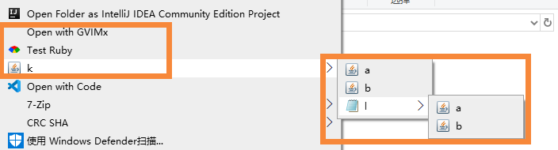

# RMenu
Windows Explorer Menu Generator


## usage
```ruby
require "path\\to\\menu.rb"
clean
folder "Open with GVIMx", exe: "gvim"
group [:bg, :drive, :folder, :file], "Test Ruby", exe: "ruby", ext: ".rb", code: %{
   puts 'Hello world'
   puts ARGV[0]
   system "pause"
}, icon: "ruby"

group [".rb", ".rbw"], "run", exe: "ruby", ext: ".rb", code: %{
   system "ruby \#{ARGV[0]}"
   system "pause"
} 
```



## words

Throw away your old-fashioned IDEs.    
Be companion with vim/emacs and other unique tools.    
Make your explorer a unified development environment(UDE).    
